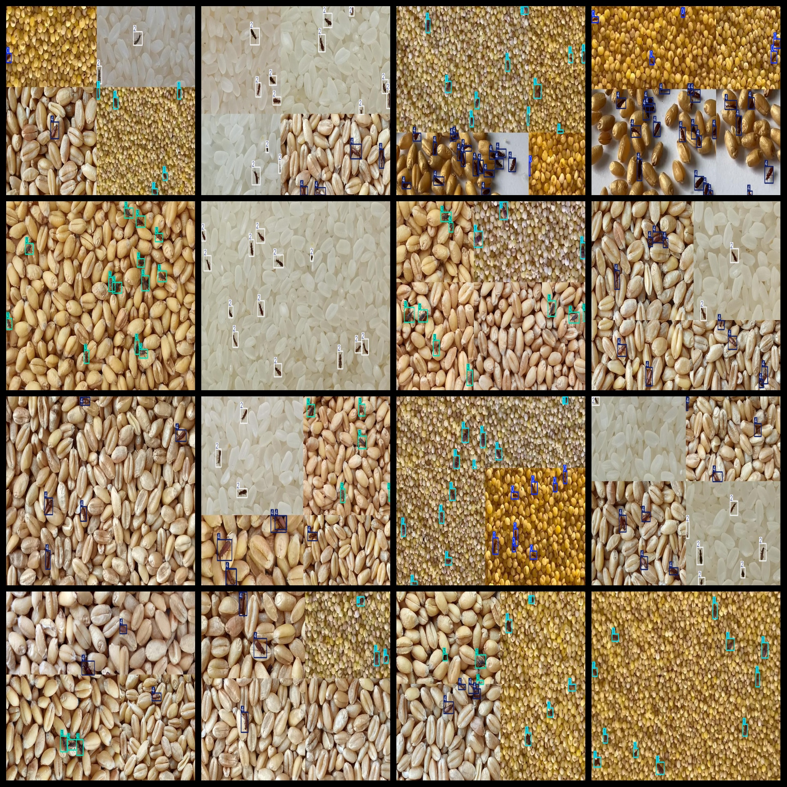
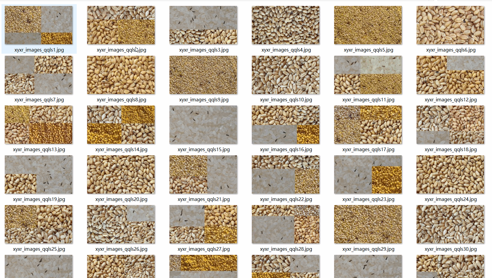

# 5 Types of Grains Pest Dataset: 4493 Images in VOC+YOLO Format (Enhanced)

This dataset consists of five types of grain pests, comprising 4493 images in VOC+YOLO format (enhanced). The dataset is organized into three folders for image storage, an XML file for annotations, and a txt file for labels. The JPEGImages folder contains a total of 4493 jpg images. The Annotations folder contains a total of 4493 xml files, while the labels folder contains a total of 4493 txt files. There are a total of five label categories: ["0", "1", "2", "3", "4"].

Each category has a specified number of bounding boxes (note that the order in the yolo format does not correspond to this, but rather to the classes.txt file in the labels folder):

- 0 frames = 12615 (Rust Curculio)
- 1 frames = 10205 (Tobacco Snail)
- 2 frames = 12430 (Saw Gallwasp)
- 3 frames = 11851 (Mite)
- 4 frames = 15956 (Red Milagro Cricket)

Total bounding box count: 63057

The image resolution is clear with high quality. The images have been enhanced.

GitHub repository location: datasets_sl

The shape of the labels is rectangular bounding boxes for target detection recognition.

Important note: No guarantee is made regarding the accuracy of models trained on this dataset or any weight files. This dataset provides accurate and reasonable annotations only.

Annotation and image details are as follows:

## Images

---

Here is a pay link on Stripe (https://buy.stripe.com/3cs8yP7sY87d0vu9AB). Please contact me lonlonago@foxmail.com after funding $89, and I will send you a complete data files, thank you!

